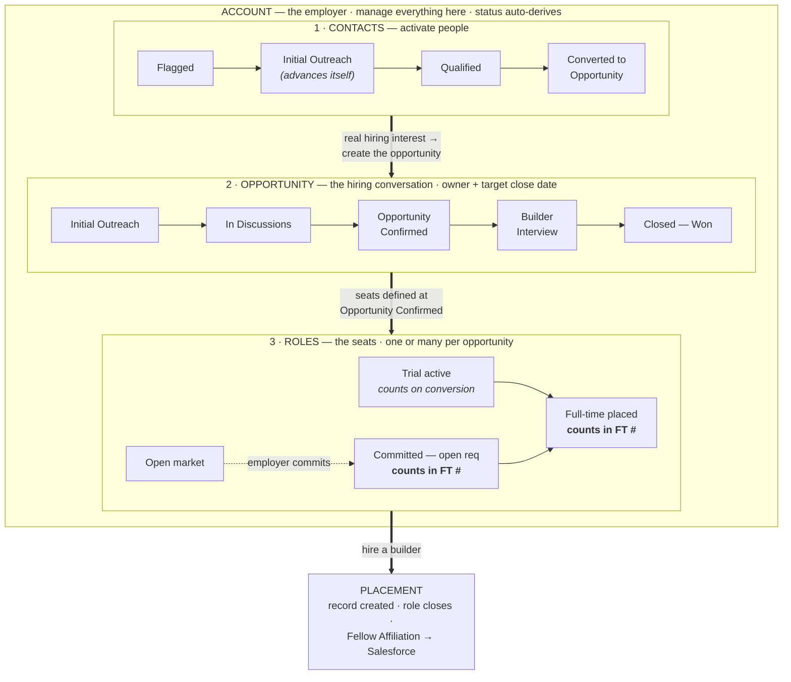
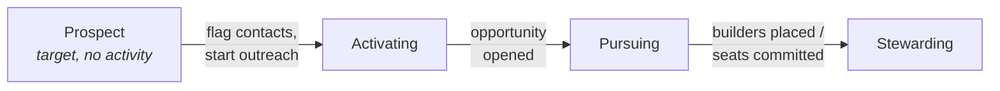

# PURSUIT · Jobs Playbook 2026

**Employer Partnerships & Placement** · Scope: getting builders hired · Last updated July 2026
*Modeled on the Fundraising Playbook 2026 — same discipline, different pipeline.*

---

## Section 1 · Team expectations

- Keep opportunities current: **Stage, Roles, Salary, Owner, Target close date**.
- **Log manual touches within 24 hours** — texts, LinkedIn DMs, ad-hoc calls. Email and meetings are captured automatically (see Section 8 — you never log those).
- Create a **Task** for every pending follow-up; update task status daily.
- Every active account has an **Account Owner** who owns the full employer lifecycle.
- Raise blockers early: contract delays, trial-conversion risk, builder-readiness gaps, anything that threatens a committed seat.

---

## Section 2 · The four objects (what you manage, where, and how it's measured)

| Object | What it is | Where you manage it | How it's measured |
|---|---|---|---|
| **Contact** | A person at an employer (or who can open doors to one) | Contacts page — flag into the pipeline, set stage, request intros | Contacts funnel + the Outreach scorecard |
| **Account** | The employer company | Accounts page — owner, warmth, roles, contacts, activity | Account status (auto-derived), warmth |
| **Opportunity** | A hiring *conversation* with an employer — named freely ("JPMC Early-Career Q3") | Opportunities page — stage, owner, target close date, activity, tasks | Opportunities funnel |
| **Role** | A specific seat under an opportunity. **One opportunity can hold one or many roles** — JPMC's single conversation carries six. | The opportunity's **Roles** tab | Placement status → FT Roles Secured |

**The chain:** activate a *contact* → that warms an *account* → the conversation becomes an *opportunity* → the commitment becomes *roles* (one or many) → a hire becomes a *placement*.

**The full picture — how one employer progresses.** Everything below lives on the **account page** (contacts, opportunities, roles, activity, tasks), so the account is where you manage the whole story at once:

The account's status follows this progression on its own — your job is to move it rightward:

**Where leads come from — two arms:**
1. **Existing partnerships.** Funders and program partners who meet our builders (demo days, grants, workshops) and get interested in hiring. These arrive warm through the fundraising side.
2. **Staff network.** Pursuit staff's combined LinkedIn networks — 40,000+ people — scraped into the contact base. The team filters by industry/role, flags targets, and requests warm intros from the connected staffer.

**When to move levels:** work at the **contact** level until there's a real conversation. Once an employer is genuinely engaged, manage at the **account** level; on any signal of hiring interest, create the **opportunity**; when they commit to specific seats, create the **roles**. Don't keep working a contact's stage after the account has a live opportunity — mark them Converted to Opportunity and manage the opportunity.

---

## Section 3 · Contacts — the activation pipeline

- Anyone can live in the contact base; **flagging** a contact makes them a *lead* — they enter the funnel.
- Stages: **Flagged → Initial Outreach → Qualified → Converted to Opportunity**, with **On Hold** and **Not a fit** as parking/exit dispositions.
- *Definitions the funnel uses:* a **lead** is a contact someone deliberately flagged (or requested an intro to). **Outreach** starts when the first real touch happens. Being in the database is neither.
- **Initial Outreach advances itself.** Once a flagged contact gets real jobs outreach — a synced email or meeting, or a touch you log — they move to Initial Outreach automatically, with the who/when stamped from the actual activity. You never set that stage by hand. **Qualified** and **Converted to Opportunity** are your judgment calls — those you set.
- **Intro requests** are how the network gets activated: request an intro from the connected staffer → they're notified in Slack and on their Home page → they accept/decline/make the intro → the contact moves through the funnel. Every staffer also has a **My Network** view to pre-mark their own connections ("would reach out" / "not a fit") — do this once and the team's lead list builds itself.

---

## Section 4 · Account statuses (auto-assigned — drive the activity, not the label)

| Status | Meaning |
|---|---|
| **Prospect** | Target employer. No business or jobs activity yet. |
| **Activating** | Contacts flagged / outreach underway; no opportunity yet. |
| **Pursuing** | An open, active opportunity exists at this account. |
| **Stewarding** | Builders placed or committed seats in effect; no open opportunity. |
| **Re-activating** | Past business, recent re-engagement (activity in the last 3 months). |
| **Dormant** | Past business, no open opps, no activity in the last 3 months. |

Status updates automatically from activity in Bedrock. Your job is to move accounts rightward.

---

## Section 5 · Opportunity stages & roles

**Early:** Initial Outreach → In Discussions
**Late:** Opportunity Confirmed → Builder Interview
**Closed:** Closed — Won · Closed — Lost
Every opportunity carries a **Target close date** — keep it honest; pipeline reviews trend against it.

An opportunity is the conversation; **roles are the seats** — add one role per seat as they're defined (a single opportunity often carries several). Each role tracks its own commitment truth:

| Role status | Meaning |
|---|---|
| **Open market** | CVs welcome; no hiring commitment yet |
| **Committed — open req** | Employer formally committed to the seat; unfilled. **Counts in FT Roles Secured.** |
| **Trial active** | A builder is in a committed paid trial. Shown, but **counts only on conversion** (the FT number never walks back). |
| **Full-time placed** | Builder filled the FT seat. **Counts.** |
| **Cancelled** | Seat withdrawn. Auto-unpublishes from Pathfinder. |

---

## Section 6 · Stage exit criteria

- **Initial Outreach** — exit when the employer gives a substantive reply or first meeting.
- **In Discussions** — exit when hiring intent is explicit (they want builders, not just coffee).
- **Opportunity Confirmed** — set when the employer is formally engaged on specific hiring. Add the **roles** as they're defined — title, approx. salary, start date, committed vs open-market — and set the **target close date**.
- **Builder Interview** — log each builder against a **specific role** (applied / interviewing / hired) with the real date applied.
- **Closed — Won** — the hire or commitment lands; every seat is recorded as a role.
- **Failure exits:** Closed — Lost, with a reason. An opportunity that goes quiet isn't lost until it's told to you — keep a task on it.

---

## Section 7 · Placements & the systems behind them

- **Hiring a builder into a role** does three things automatically: creates the placement record (the source of truth for all metrics), closes the role, and pushes a **Fellow Affiliation to Salesforce** (contact + employer account + start date) — which is where Bond and post-placement management run.
- **Trials:** hire the builder into the *trial* role. When it converts, hire them into the *conversion seat* — that's when they count as FT placed. (Fowler and JPMC are the reference setups.)
- **Contracts:** upload the contract on the placement when the hire lands.
- **Pathfinder:** flip a role's visibility toggle to publish it to the builder-facing feed. Filling or cancelling the role pulls the posting automatically — never leave a stale ad.
- **Start dates are required at hire.** Record pay amounts too: typed contract work counts as paid work even without an amount, but salary metrics need the number.

---

## Section 8 · Activity capture — what's automatic, what you log

**You never log emails or meetings.** Bedrock syncs every staff member's Gmail and Calendar daily (external messages and meetings only), then an AI classifier reads each item and decides whether it's jobs work — judging the *intent* of the message (offering builders, probing hiring needs, coordinating interviews) rather than who it's with, since the same company can be a funder one week and an employer the next.

What that means in practice:
- **Automatic:** all email, all calendar meetings — captured, linked to the right contact and account, and classified. Out-of-office and auto-replies are excluded. Fundraising and program mail never inflates jobs numbers.
- **You log manually (within 24h):** texts, LinkedIn DMs, ad-hoc phone calls — these always count as jobs outreach, and the form lets you backdate to the day it happened.
- **Intro requests** automatically mark that contact's activity as jobs-relevant.
- **Tasks move opportunities forward; Activities reveal relationship history.** Check tasks daily; keep due dates honest.

---

## Section 9 · One Bedrock, two pipelines — how Jobs relates to Fundraising

Bedrock started as the fundraising team's layer over Salesforce; the jobs layer shares its foundation. What's shared and what differs:

| | Fundraising side | Jobs side |
|---|---|---|
| **Contacts** | Salesforce contacts (funders) | The full universe — Salesforce **plus** the 40k+ staff-network import. Only contacts tied to real revenue ever need to reach Salesforce. |
| **Accounts** | Funder organizations | The same company records — one account can be funder *and* employer |
| **Opportunities** | Revenue opps, live in Salesforce (Stage, Close Date, Amount, Probability) | Hiring opps, live in Bedrock only — most jobs work isn't revenue, so it stays out of SF |
| **The close** | Award record, payment schedule, reporting | Placement record → **pushed to Salesforce as a Fellow Affiliation** for Bond and post-placement management |
| **Where you work** | Portfolio nav (Accounts / Contacts / Pipeline) | The **Jobs** tab (Home / Performance / Accounts / Opportunities / Contacts / Builders) |

Rules of the road: the same person or company can appear on both sides — the activity classifier judges each interaction's purpose, so working an employer angle at a funder account never distorts either team's numbers. Leads flow both directions: philanthropy meetings surface hiring interest (hand it to jobs), and jobs conversations surface funding interest (hand it to PBD).

---

## Section 10 · How we're measured

- **FT Roles Secured** = builders placed full-time **+** committed open seats. Trials show but count on conversion. Cohort views count only that cohort's placements — committed seats display separately (they belong to no cohort).
- **Builders w/ Paid Work** = distinct builders with any paid engagement; the drill shows every paid role each builder has held.
- **Funnels** — Opportunities (by stage, each opp's roles and commitments visible), Contacts (by pipeline stage), Builders (L3+ pool → paid → FT).
- **Outreach & Activation** — accounts reached over time by the core jobs team, new vs existing, with a staff-mobilization view for everyone else's network activation.

**The Outreach tab** (the Monday scorecard — reports on the last *completed* Sun–Sat week vs the one before):
- **User Pipeline** — contacts entering each stage this period vs last (Flagged → Initial Outreach → Qualified → Converted to Opportunity), split Warm vs Cold. *Initial Outreach counts contacts actually emailed; the later stages count when you move the contact's stage — so keeping stages current is what makes this scorecard true.*
- **Activity Pipeline** — sends by channel (direct email / LinkedIn / facilitated intros), engagements (meetings + calls + replies), and direct email response rates.
- **Deep dive** — per-sender breakdown, warm/cold origin comparison, targeting mix (industry, company size, lead source), and the account working list.
- Every row drills down to the underlying contacts and emails. Warm = the company had a Bedrock presence before that contact's first touch.

---

## Clean data is everyone's job.

Keep **Stage, Roles, Salary, Owner, and Target close date** current.
Log manual touches within 24 hours — the system captures the rest.
If it isn't in Bedrock, it didn't happen.
